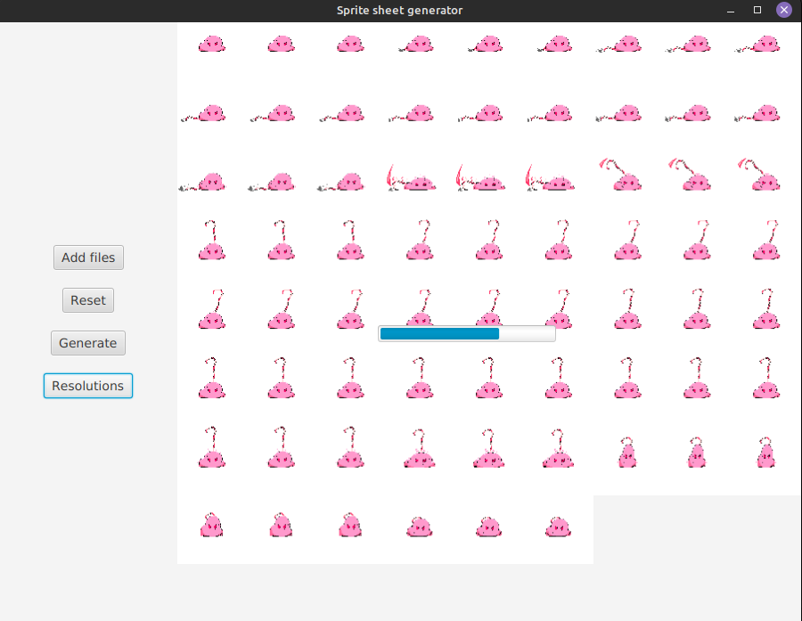

# SpriteSheetGenerator
Generates sprite sheets hassle free

Simply select the files to export and click on generate to save your sprite sheet
The Resolutions button exports everything in 4k 1440p 1080p and 720p automatically

This was created specifically for Godot in mind, but it might be useful for everyone looking to generate sprite sheets
